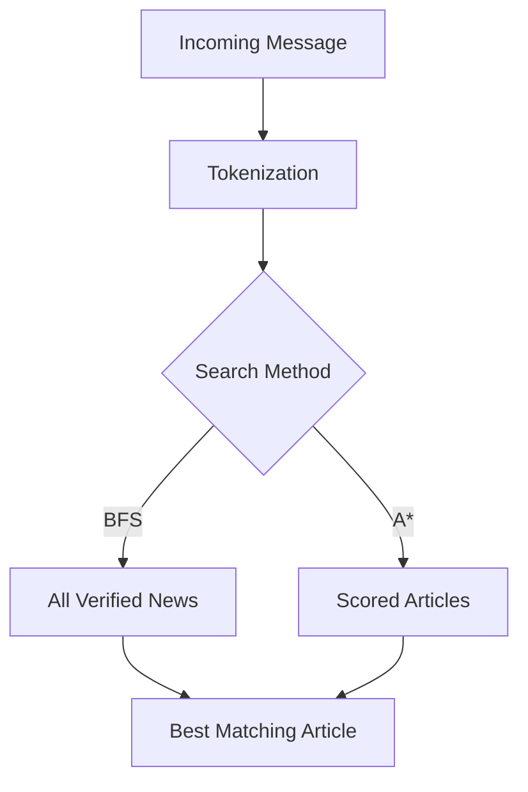
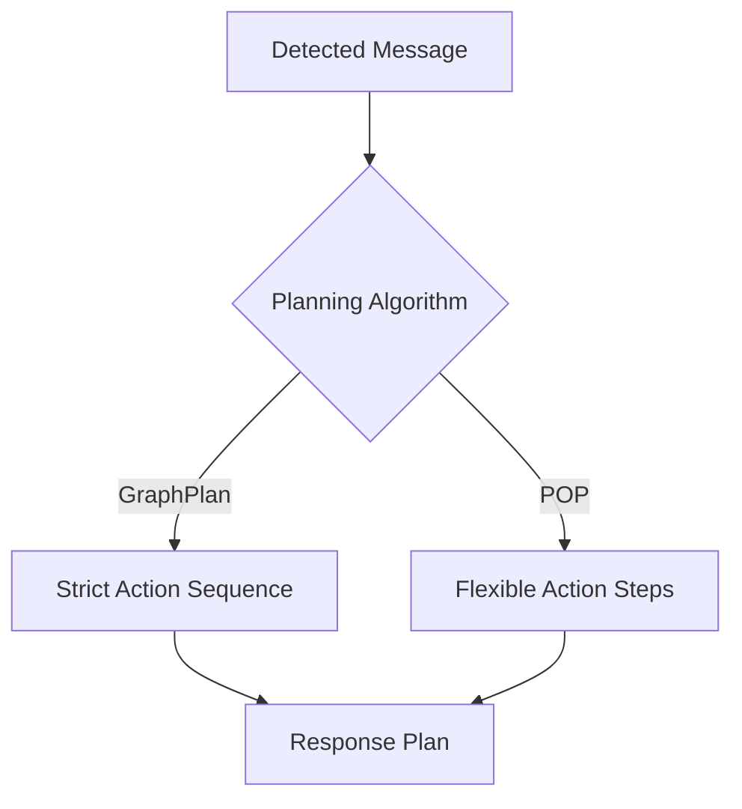

# 🌀 Odisha Disaster FakeNews Identification

### AI-Driven Misinformation Detection & Response System

**Group 8 – M.Tech CSE (AI Project)**

---

## 📌 Project Overview

During disasters such as Cyclone Fani, misinformation spreads rapidly across platforms like WhatsApp and Facebook. This project aims to:

- Automatically detect disaster-related misinformation
- Retrieve verified facts from a curated knowledge base
- Plan a safe, fact-checked response using AI planning algorithms
- Generate public advisories based on verified information
- Adaptively moderate messages using Reinforcement Learning

**Key technologies used:**
- Bayesian Networks
- BFS & A* Graph Search
- GraphPlan & Partial-Order Planning (POP)
- Q-Learning (Reinforcement Learning)
- LLM-based Advisory Generation

---

## 📂 Project Structure

The repository is organized by core AI modules and data sources.

```text
Odisha-Disaster-FakeNews-Identification/
│
├── main.py
├── README.md
├── requirements.txt
│
├── data/
│   └── knowledge_base.json
│
├── bn/
│   └── bayes_network.py
│
├── retrieval/
│   └── graph_search.py
│
├── planning/
│   ├── graphplan.py
│   └── pop.py
│
├── rl/
│   └── moderation_rl.py
│
└── advisory/
    └── advisory_generator.py
```

---

## 🧠 Module Descriptions

Each module addresses a step in the misinformation detection and response pipeline.

---

### Bayesian Misinformation Detection

**File:** `bn/bayes_network.py`

This module uses a Bayesian Network to estimate the probability that an incoming message is misinformation. It considers:

- Source credibility
- Linguistic uncertainty
- Sensational keywords
- Contradiction with verified facts

**Output:** Probability score (Low / Medium / High).

---

### Evidence Retrieval (BFS and A\* Search)

**File:** `retrieval/graph_search.py`

This module retrieves the most relevant verified news or fact by:

- Tokenizing the incoming message
- Performing a Breadth-First Search (BFS) for global keyword matches
- Using A* Search for best-match scoring based on keyword overlap

**Output:** Most relevant factual article from the knowledge base.

#### Evidence Retrieval Workflow



---

### Response Planning (GraphPlan & POP)

**Files:** `planning/graphplan.py`, `planning/pop.py`

These modules generate a plan for addressing the misinformation:

- **GraphPlan:** Produces a strict action sequence for fact-checking, counter-messaging, and escalation.
- **POP (Partial-Order Planning):** Allows flexible, parallelizable action plans.

**Actions include:**
- VerifySource
- RetrieveFact
- GenerateCounterMessage
- EscalateToHumanReview

#### Response Planning Flow



---

### Reinforcement Learning (Q-learning)

**File:** `rl/moderation_rl.py`

This module learns optimal moderation actions over time:

- **Actions:** AutoRespond, Ignore, Escalate
- **Rewards:** Minimize harm, reduce false alarms, and lessen human moderator workload

**Output:** Adaptive moderation policy.

---

### Safe Advisory Generation

**File:** `advisory/advisory_generator.py`

This module creates calm, fact-checked, and non-panic public advisories based on:

- Retrieved verified news
- AI language modeling (LLM)

**Output:** Advisory message suitable for public dissemination.

---

## ▶️ How to Run

Follow these steps to set up and use the system.

### 1. Install dependencies

Install all required packages:

```bash
pip install -r requirements.txt
```

### 2. Run the system

Start the main program:

```bash
python3 main.py
```

### 3. Enter any incoming news message

Example input:

```text
Water in Puri has become poison after Fani.
```

**Outputs:**
- Bayesian misinformation probability score
- Best matching verified news article
- BFS and A* search results
- Fact-checked advisory message
- GraphPlan and POP response plans
- RL-based moderation policy

---

## 📊 Dataset

The `knowledge_base.json` is a curated set of over 150 disaster-related verified and debunked items.

**Content includes:**
- Cyclones, Floods, Heatwaves
- Fake videos/images
- Evacuation and water safety reports
- Relief operations

**Each entry contains:**
- `id`, `title`, `text`
- `tags`
- `is_verified`
- Optional `links`

---

## 👥 Team Members – Group 8

*Add your names below:*

- Raj Kumar Singh (25CS06017)
- Prashant Kumar (25AI06019)
- Utsaw Kunar (25CS06023)
- Abhishek Kumar (25CS06012)
- Sandeep Kumar (25CS06018)
- Sujeet Kumar Yadav (25CS06022)
- Dev Patel (25CS06015)
- Priyanka Kundu (25CS06011)
- Ashish Kumar (25CS06013)

---

## 🚀 Future Enhancements

Potential project extensions include:

- BERT-based semantic search
- Multimodal detection (image + text)
- Real-time FastAPI web service
- Graph neural network for fact verification

---

## ⭐ Star this repository if you found it helpful!

---

```card
{
    "title": "Best Practice",
    "content": "Ensure the knowledge base is regularly updated with new verified and debunked disaster information for optimal performance."
}
```

---

**If you need additional project resources (PPT, report PDF, architecture diagram, demo script, or GitHub Pages), feel free to request them!**

